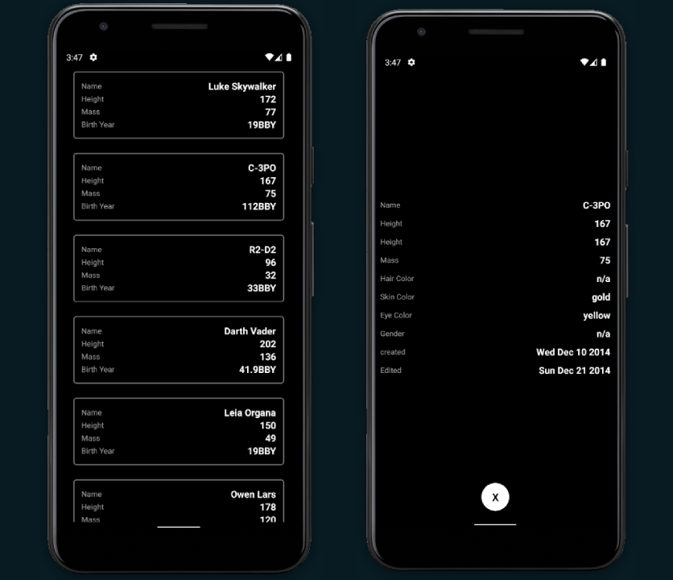

# Network call test

Network call test 




* ```git clone https://github.com/nithinpp69/network_call_test.git```
* run ```npm install``` or ```yarn``` to install all depencies
* ANDROID ```npm run android``` or ```yarn android``` 
* IOS ```npm run ios``` or ```yarn ios``` 

### Install the dependencies

* ```yarn```   or   ```npm i```

### Run Android

* ```yarn android```  or  ```npm run android```

### Run iOS

* ```yarn ios```  or  ```npm run ios```
